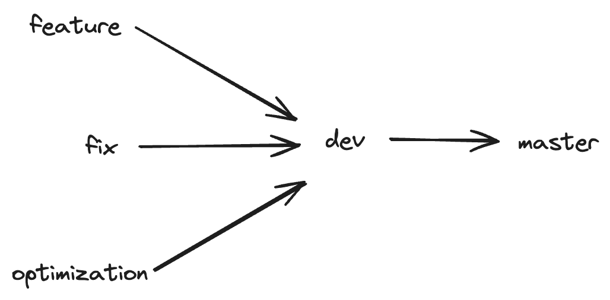

Visualize commits in a tree like structure:

```git
git log --graph --decorate --oneline
```

Revert the last commit already pushed to remote:

```git
git reset HEAD^ --hard
git push origin -f
```

# Branches
One good way to manage branches when working with multiple things in same projects is following:

## Without absolute path
![[branches.png]]


![[../../Assets/branches.png]]

## With Absolute Path
